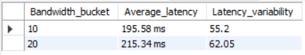

🏥 Healthcare Security Data Analytics using MySQL
📌 Project Overview

This project analyzes a Healthcare Security Dataset sourced from Kaggle using MySQL Workbench. The dataset focuses on healthcare institutions, patient vitals, and diseases, while also integrating blockchain logs for secure transaction tracking and optimization metrics for system performance evaluation.

The project demonstrates how SQL-based analytics can be applied to healthcare + blockchain-integrated systems, with emphasis on:

Healthcare data evaluation

Blockchain transaction status analysis

Optimization and performance monitoring

📂 Dataset Description

The project uses three CSV files, imported as separate MySQL tables:

healthcare_data

Contains hospital, patient, and disease-related information

Key attributes:

Hospital_ID, Patient_ID, Age, Gender, Blood_Pressure, Glucose, Heart_Rate, Cholesterol and Diagnosis_Label

blockchain_logs

Logs related to healthcare blockchain transactions

Key attributes:

Block_ID, Timestamp, Client_ID, Model_Update_Hash, ECDSA_Signature, Transaction_Type and Status

optimization_metrics

Performance and resource allocation metrics

Key attributes:

Round, Client_ID, Local_Epochs, Data_Size_MB, Latency_ms, Bandwidth_Mbps, Aggregation_Time_ms and Resource_Allocation_Score

🔑 SQL Concepts & Techniques Used

The project leverages a range of SQL functionalities for deeper insights:

Joins – Linking healthcare, blockchain, and optimization tables for integrated analysis

CASE statements – Categorizing patient vitals into buckets (e.g., BP ranges, Glucose levels)

Aggregate Functions – AVG(), STDDEV(), COUNT(), MAX(), MIN() for summary insights

Filtering with WHERE – Analyzing subsets of patients, transactions, or performance metrics

Timestamps – Extracting and analyzing time-based trends in blockchain logs

Performance Metrics – Evaluating system efficiency based on latency, bandwidth, and aggregation times

📊 Example Analysis Performed

Average glucose level of patients grouped by disease

Standard deviation of heart rate across hospitals

Categorization of blood pressure readings (Normal, Pre-hypertension, Hypertension)

Blockchain transaction success vs. failure rates over time

Correlation of resource allocation score with data size and latency

🛠️ Tools & Technologies

MySQL Workbench – SQL querying and schema design

Kaggle Dataset – Source of healthcare, blockchain, and optimization data

CSV Import – Loading structured data into MySQL

🚀 How to Use

Clone this repository:

git clone https://github.com/senmihir12/Healthcare-Security-Project.git

Import the CSV files into MySQL as separate tables:

healthcare_data

blockchain_logs

optimization_metrics

Run the SQL scripts provided in the repository to perform analysis.

📌 Key Learnings

Integration of healthcare + blockchain data in SQL workflows

Practical use of SQL joins, case statements, and aggregations

Application of performance and optimization metrics in healthcare security

🖼️ Table Structure & Sample Screenshots

To provide better context, screenshots of the table structures and sample records from each dataset (healthcare_data, blockchain_logs, and optimization_metrics) are included for quick reference.

# Age distribution by diagnosis

# Average vitals by gender

# Top hospitals by heart disease cases

# Average latency and bandwidth per hospital

# Model update contribution analysis

# Top resource allocation hospitals

# Latency vs aggregation time correlation check

# Most common diseases by gender

# Average vitals for diseased vs healthy patients

# Age distribution buckets

# Average Aggregation Time

# Transaction type vs status success rate

# Hospital Performance by model contribution

# Latency vs bandwidth relation

# Hospital data handling stats

# Resource allocation efficiency vs data size

# High latency transactions that still succeeded

# Resource allocation stability over time

# Peak system load times

# Performance drift check between first and second half of rounds

# Resource allocation efficiency by round

